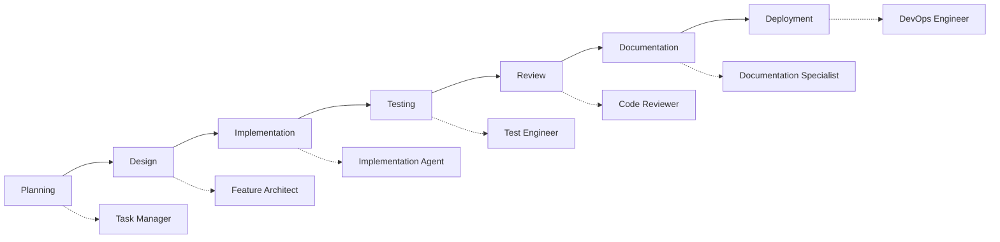

# GitHub Copilot Chat Modes - Ikhtibar Project

This directory contains specialized GitHub Copilot chat modes designed for different phases of the Software Development Life Cycle (SDLC) for the Ikhtibar educational exam management system.

## Available Chat Modes

### 🏗️ [Feature Architect](./feature-architect.md)
**Focus**: System Design & Technical Planning  
**Use When**: Starting new features, designing system architecture, creating technical specifications  
**Expertise**: High-level architecture, API design, data flow diagrams, implementation planning  

**Example Prompts:**
- "Design a notification system for exam alerts"
- "Architect a question bank with categorization and tagging"  
- "Plan the user management and role-based access system"

---

### 💻 [Implementation Agent](./implementation-agent.md)
**Focus**: Writing Production-Ready Code  
**Use When**: Converting specifications into working code, following established patterns  
**Expertise**: Full-stack development, Clean Architecture, SOLID principles, testing  

**Example Prompts:**
- "Implement user management CRUD operations"
- "Create a question bank component with search and filtering"
- "Build the exam taking interface with timer and auto-save"

---

### 🧪 [Test Engineer](./test-engineer.md)
**Focus**: Comprehensive Testing Strategy  
**Use When**: Creating test suites, improving code quality, ensuring reliability  
**Expertise**: Unit testing, integration testing, E2E testing, performance testing  

**Example Prompts:**
- "Create comprehensive tests for the user authentication system"
- "Test the question bank CRUD operations with edge cases"
- "Write E2E tests for the exam taking workflow"

---

### 📋 [Task Manager](./task-manager.md)
**Focus**: Breaking Down Complex Work  
**Use When**: Planning implementation, creating actionable tasks with validation  
**Expertise**: Task decomposition, dependency management, validation planning  

**Example Prompts:**
- "Break down user authentication system implementation into tasks"
- "Create tasks for building a question bank with categorization"
- "Generate task list for exam monitoring dashboard"

---

### 👁️ [Code Reviewer](./code-reviewer.md)
**Focus**: Code Quality Assessment  
**Use When**: Reviewing code for quality, security, performance, and best practices  
**Expertise**: Security review, performance analysis, architecture validation  

**Example Prompts:**
- "Review the user authentication implementation for security issues"
- "Analyze the question bank API for performance problems"
- "Check the exam monitoring dashboard for code quality"

---

### 📚 [Documentation Specialist](./documentation-specialist.md)
**Focus**: Creating Comprehensive Documentation  
**Use When**: Writing technical docs, user guides, API documentation  
**Expertise**: Technical writing, API specs, user guides, architectural documentation  

**Example Prompts:**
- "Create API documentation for the user management endpoints"
- "Write a user guide for exam creation and management"
- "Document the deployment process for the application"

---

### 🚀 [DevOps Engineer](./devops-engineer.md)
**Focus**: Deployment & Infrastructure  
**Use When**: Setting up CI/CD, containerization, cloud infrastructure  
**Expertise**: Docker, Azure, GitHub Actions, monitoring, security  

**Example Prompts:**
- "Set up CI/CD pipeline for the Ikhtibar application"
- "Create Docker containers for backend and frontend"
- "Design Azure infrastructure for production deployment"

## How to Use These Chat Modes

### Method 1: Direct Reference
Copy and paste the content from the desired chat mode file into your conversation with GitHub Copilot.

### Method 2: Mode Switching
Start your conversation by referencing the mode:
```
I want you to act as the Implementation Agent from our chat modes. 
Help me implement user management CRUD operations following our established patterns.
```

### Method 3: Context Loading
Upload the specific chat mode file as context when starting a new conversation.

## Project Context

All chat modes are designed specifically for the **Ikhtibar Educational Exam Management System** with these technical specifications:

### Backend Stack
- **Framework**: ASP.NET Core 8.0 Web API
- **ORM**: Dapper (micro-ORM)
- **Database**: SQL Server
- **Authentication**: JWT Bearer tokens
- **Architecture**: Clean Architecture with folder-per-feature

### Frontend Stack  
- **Framework**: React.js 18 with TypeScript
- **Build Tool**: Vite
- **Styling**: Tailwind CSS
- **State Management**: React Query + Zustand
- **Internationalization**: English/Arabic (RTL/LTR support)

### Key Principles
- **Single Responsibility Principle (CRITICAL)**: Each layer has one responsibility
- **Layer Separation**: Controllers → Services → Repositories
- **Folder-per-Feature**: Organized by business domain
- **Security First**: Input validation, parameterized queries, proper error handling
- **Performance**: Caching, optimization, responsive design

## SDLC Integration

These chat modes are designed to support the complete development lifecycle:



## Best Practices for Chat Mode Usage

### 1. Start with Context
Always provide relevant context about what you're working on:
- Which module/feature
- Current state of the code
- Specific requirements or constraints

### 2. Be Specific with Requests
Instead of: "Help me with users"
Use: "Implement user CRUD operations following our repository pattern with proper validation and error handling"

### 3. Leverage Mode Expertise
Each mode is optimized for specific tasks. Use the right mode for the right job:
- Use **Feature Architect** for planning and design
- Use **Implementation Agent** for coding
- Use **Test Engineer** for testing strategy
- Use **Code Reviewer** for quality assessment

### 4. Combine Modes When Needed
For complex features, you might need multiple modes:
1. **Feature Architect** → Design the feature
2. **Task Manager** → Break it into tasks  
3. **Implementation Agent** → Write the code
4. **Test Engineer** → Create tests
5. **Code Reviewer** → Review quality
6. **Documentation Specialist** → Document the feature

### 5. Follow Validation Loops
Each mode includes validation commands and success criteria. Always run these to ensure quality.

## Troubleshooting

### If a Mode Doesn't Understand Context
- Provide more specific information about the Ikhtibar project
- Reference existing code patterns or files
- Include relevant technical requirements

### If Responses Aren't Specific Enough
- Ask for specific file paths and code examples
- Request validation commands
- Ask for step-by-step instructions

### If Code Doesn't Follow Patterns
- Remind the mode about our specific architecture (folder-per-feature, Clean Architecture)
- Reference the project's coding standards
- Ask for adherence to SRP and layer separation

## Contributing to Chat Modes

When updating or adding new chat modes:

1. **Follow the established format** with clear sections for expertise, standards, and examples
2. **Include practical code examples** that match our tech stack
3. **Provide validation commands** for quality assurance
4. **Update this index file** with the new mode information
5. **Test the mode** with real scenarios from the project

## Version History

- **v1.0** - Initial chat modes based on PRP templates
- **v1.1** - Enhanced with project-specific context and examples
- **v1.2** - Added comprehensive validation commands and anti-patterns

---

*These chat modes are living documents that evolve with the project. Keep them updated as our practices and standards change.*
