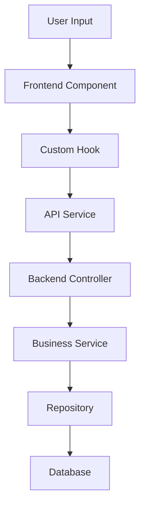

---
inputs:
  - name: type
    description: Type of documentation to create (feature, api, component, architecture, deployment)
    required: true
  - name: target
    description: Target module, component, or scope for documentation
    required: true
  - name: format
    description: Documentation format (comprehensive, quickstart, reference, guide)
    required: false
    default: comprehensive
---

---
command: "/document"
---
# Documentation Generator Command for GitHub Copilot

## Command Usage
```
@copilot /document [type] [target] [format]
```

## Purpose
This command generates comprehensive documentation for the Ikhtibar examination management system, covering both ASP.NET Core backend and React.js frontend components. It follows project-specific patterns, architectural guidelines, and supports internationalization.

**Input Parameters**: 
- `type` - Documentation type: `feature`, `api`, `component`, `architecture`, or `deployment`
- `target` - Specific module, component, or scope to document
- `format` - Format style: `comprehensive`, `quickstart`, `reference`, or `guide`

## How /document Works

### Phase 1: Context Discovery and Analysis
```markdown
I'll help you create comprehensive documentation for the Ikhtibar project. Let me analyze your request and gather the necessary context.

**Phase 1.1: Parse Documentation Request**
```
Documentation Request Analysis:
- **Type**: [FEATURE/API/COMPONENT/ARCHITECTURE/DEPLOYMENT]
- **Target**: [SPECIFIC_MODULE_OR_COMPONENT]
- **Format**: [COMPREHENSIVE/QUICKSTART/REFERENCE/GUIDE]
- **Project Context**: ASP.NET Core + React.js with TypeScript
- **Architecture**: Folder-per-feature with Clean Architecture
```

**Phase 1.2: Context Gathering using GitHub Copilot Tools**
```
I'll gather comprehensive project context using GitHub Copilot's native tools:
- semantic_search: "[TARGET] implementation patterns" # Find existing patterns
- file_search: "**/*[TARGET]*" # Find related files
- read_file: [RELEVANT_FILES] # Read implementation details
- grep_search: "[TARGET]|[RELATED_TERMS]" # Find usage patterns
- list_dir: [RELEVANT_DIRECTORIES] # Explore structure
- get_errors: [TARGET_FILES] # Check current status
```

**Phase 1.3: Project Architecture Analysis**
```
Architecture Context Analysis:
- [ ] **Tech Stack**: ASP.NET Core (.NET 8), React 18, TypeScript, Tailwind CSS
- [ ] **Architecture Patterns**: Clean Architecture, CQRS, Repository Pattern
- [ ] **Frontend Patterns**: Folder-per-feature, Custom Hooks, Component Library
- [ ] **Data Layer**: Dapper, SQL Server
- [ ] **Authentication**: JWT with refresh tokens, OAuth integration
- [ ] **Internationalization**: i18next with English/Arabic support
- [ ] **Testing Strategy**: Unit tests, integration tests, E2E tests
- [ ] **Deployment**: Azure Container Apps, Docker containerization
```
```

### Phase 2: Type-Specific Documentation Generation

#### For Type: `feature`
```markdown
**Phase 2.1: Feature Documentation Generation using GitHub Copilot Tools**
```
I'll create comprehensive feature documentation by analyzing the implementation:

## 📋 Feature Documentation: [TARGET] (Tool-Enhanced)

### Feature Discovery and Analysis
```powershell
# Comprehensive feature analysis using GitHub Copilot tools
semantic_search: "[TARGET] feature implementation" # Find feature patterns
file_search: "**/*[TARGET]*/**" # Find all feature files
grep_search: "[TARGET]" # Find feature usage
test_search: [FEATURE_FILES] # Find related tests
```

### Feature Overview (Tool-Informed)
- **Feature Name**: [TARGET]
- **Module Location**: [DISCOVERED_PATH]
- **Primary Purpose**: [PURPOSE_FROM_CODE_ANALYSIS]
- **User Stories**: [EXTRACTED_FROM_REQUIREMENTS]
- **Implementation Status**: [STATUS_FROM_TOOL_ANALYSIS]

### Architecture Overview (Tool-Generated)
#### Backend Implementation
```csharp
// Analysis results using semantic_search and file_search
Entity: [ENTITY_CLASS] // Located at: [PATH]
Repository: [REPOSITORY_CLASS] // Located at: [PATH]  
Service: [SERVICE_CLASS] // Located at: [PATH]
Controller: [CONTROLLER_CLASS] // Located at: [PATH]
DTOs: [DTO_CLASSES] // Located at: [PATHS]
```

#### Frontend Implementation
```typescript
// Analysis results using file structure examination
Components: [COMPONENT_LIST] // Located at: [PATHS]
Hooks: [HOOK_LIST] // Located at: [PATHS]
Services: [SERVICE_LIST] // Located at: [PATHS]
Types: [TYPE_DEFINITIONS] // Located at: [PATHS]
Views: [VIEW_COMPONENTS] // Located at: [PATHS]
```

### Data Flow Analysis (Tool-Enhanced)


### API Endpoints (Tool-Discovered)
```
Using grep_search and semantic_search to find API endpoints:
```

| Method | Endpoint | Purpose | Request | Response |
|--------|----------|---------|---------|----------|
| [HTTP_METHOD] | [ENDPOINT_PATH] | [PURPOSE] | [REQUEST_TYPE] | [RESPONSE_TYPE] |

### Business Rules (Tool-Extracted)
1. **Rule**: [BUSINESS_RULE_1]
   - **Source**: [DISCOVERED_IN_SERVICE_LAYER]
   - **Implementation**: [CODE_LOCATION]
   - **Validation**: [VALIDATION_LOGIC]

### Security Considerations (Tool-Analyzed)
- [ ] **Authentication**: [AUTH_STATUS] (verified with security pattern search)
- [ ] **Authorization**: [AUTHZ_STATUS] (verified with role-based access search)
- [ ] **Input Validation**: [VALIDATION_STATUS] (verified with validation pattern search)
- [ ] **SQL Injection Prevention**: [PROTECTION_STATUS] (verified with query analysis)

### Testing Coverage (Tool-Validated)
```
Using test_search and run_tests for coverage analysis:
- Unit Tests: [TEST_COUNT] tests covering [COVERAGE_PERCENTAGE]%
- Integration Tests: [INTEGRATION_TEST_COUNT] tests
- E2E Tests: [E2E_TEST_COUNT] scenarios
```

### Usage Examples (Tool-Generated)
#### Backend Usage
```csharp
// Example based on actual implementation patterns found
[CODE_EXAMPLE_FROM_ACTUAL_IMPLEMENTATION]
```

#### Frontend Usage
```typescript
// Example based on actual component patterns found
[COMPONENT_USAGE_EXAMPLE_FROM_ACTUAL_CODE]
```

### Internationalization Support (Tool-Verified)
```json
// Translation keys found using grep_search
{
  "en": {
    "[TARGET]": {
      // English translations found in codebase
    }
  },
  "ar": {
    "[TARGET]": {
      // Arabic translations found in codebase
    }
  }
}
```
```

#### For Type: `api`
```markdown
**Phase 2.2: API Documentation Generation using GitHub Copilot Tools**
```
I'll create comprehensive API documentation by analyzing the actual implementation:

## 🔌 API Documentation: [TARGET] (Tool-Enhanced)

### API Discovery and Analysis
```powershell
# Comprehensive API analysis using GitHub Copilot tools
semantic_search: "[TARGET] controller endpoints" # Find API controllers
file_search: "**/*Controller.cs" # Find all controllers
grep_search: "\[Http.*\]|\[Route.*\]" # Find route definitions
read_file: [CONTROLLER_FILES] # Read controller implementations
```

### API Overview (Tool-Discovered)
- **API Base URL**: `https://localhost:5000/api`
- **Controller**: [CONTROLLER_NAME]
- **Authentication**: [AUTH_REQUIREMENTS] (discovered through attribute analysis)
- **Rate Limiting**: [RATE_LIMIT_INFO] (discovered through middleware analysis)

### Endpoints (Tool-Generated)

#### [ENDPOINT_GROUP_1]
##### GET [ENDPOINT_PATH]
```http
GET /api/[endpoint] HTTP/1.1
Authorization: Bearer {token}
Accept: application/json
```

**Purpose**: [PURPOSE_FROM_CODE_ANALYSIS]

**Parameters**:
| Name | Type | Required | Description |
|------|------|----------|-------------|
| [PARAM_NAME] | [PARAM_TYPE] | [REQUIRED] | [DESCRIPTION_FROM_CODE] |

**Response**:
```json
// Response schema discovered from DTO analysis
{
  [RESPONSE_SCHEMA_FROM_DTO_ANALYSIS]
}
```

**Status Codes**:
- `200 OK`: [SUCCESS_DESCRIPTION]
- `400 Bad Request`: [VALIDATION_ERROR_DESCRIPTION]
- `401 Unauthorized`: [AUTH_ERROR_DESCRIPTION]
- `404 Not Found`: [NOT_FOUND_DESCRIPTION]
- `500 Internal Server Error`: [SERVER_ERROR_DESCRIPTION]

**Example Request/Response**:
```http
# Request
GET /api/[endpoint]?param=value

# Response
HTTP/1.1 200 OK
Content-Type: application/json

{
  [EXAMPLE_RESPONSE_FROM_CODE_ANALYSIS]
}
```

### Authentication & Authorization (Tool-Analyzed)
```
Using security pattern analysis:
- Authentication Method: [JWT/OAuth/etc]
- Required Scopes: [SCOPES_FROM_ATTRIBUTE_ANALYSIS]
- Role Requirements: [ROLES_FROM_AUTHORIZE_ATTRIBUTES]
```

### Data Models (Tool-Extracted)
```csharp
// DTOs discovered through semantic_search and file_search
[DTO_DEFINITIONS_FROM_ACTUAL_CODE]
```

### Error Handling (Tool-Discovered)
```csharp
// Error handling patterns found in controllers
[ERROR_HANDLING_PATTERNS_FROM_CODE]
```

### Validation Rules (Tool-Identified)
```
Using validation pattern analysis:
- Input Validation: [VALIDATION_ATTRIBUTES_FOUND]
- Business Rules: [BUSINESS_VALIDATION_FROM_SERVICES]
- Data Constraints: [CONSTRAINTS_FROM_ENTITIES]
```
```

#### For Type: `component`
```markdown
**Phase 2.3: Component Documentation using GitHub Copilot Tools**
```
I'll create comprehensive component documentation by analyzing the implementation:

## ⚛️ Component Documentation: [TARGET] (Tool-Enhanced)

### Component Discovery and Analysis
```powershell
# Comprehensive component analysis using GitHub Copilot tools
semantic_search: "[TARGET] component implementation" # Find component patterns
file_search: "**/*[TARGET]*.tsx" # Find component files
grep_search: "interface.*Props|type.*Props" # Find prop definitions
read_file: [COMPONENT_FILES] # Read component implementations
test_search: [COMPONENT_FILES] # Find component tests
```

### Component Overview (Tool-Discovered)
- **Component Name**: [COMPONENT_NAME]
- **File Location**: [COMPONENT_PATH]
- **Component Type**: [FUNCTIONAL/CLASS] Component
- **Dependencies**: [DEPENDENCIES_FROM_IMPORTS]
- **Test Coverage**: [COVERAGE_FROM_TEST_ANALYSIS]

### Props Interface (Tool-Extracted)
```typescript
// Props interface discovered from actual code
interface [COMPONENT_NAME]Props {
  [PROPS_FROM_ACTUAL_INTERFACE]
}
```

### Usage Examples (Tool-Generated)
```typescript
// Basic usage example from actual implementation patterns
import { [COMPONENT_NAME] } from '[ACTUAL_IMPORT_PATH]';

// Example usage found in codebase or inferred from props
<[COMPONENT_NAME]
  [PROP_EXAMPLES_FROM_ANALYSIS]
/>
```

### Component States (Tool-Analyzed)
```typescript
// State management patterns discovered in component
[STATE_PATTERNS_FROM_CODE_ANALYSIS]
```

### Hooks Integration (Tool-Identified)
```typescript
// Custom hooks used by this component
[HOOKS_USAGE_FROM_CODE_ANALYSIS]
```

### Accessibility Features (Tool-Verified)
- [ ] **ARIA Labels**: [STATUS] (verified through accessibility pattern search)
- [ ] **Keyboard Navigation**: [STATUS] (verified through interaction analysis)
- [ ] **Screen Reader Support**: [STATUS] (verified through semantic analysis)
- [ ] **Focus Management**: [STATUS] (verified through focus pattern search)

### Internationalization (Tool-Checked)
```typescript
// i18n integration discovered in component
[I18N_PATTERNS_FROM_CODE_ANALYSIS]
```

### Styling (Tool-Analyzed)
```typescript
// Styling patterns found in component
[STYLING_PATTERNS_FROM_CODE_ANALYSIS]
```

### Testing Examples (Tool-Generated)
```typescript
// Test examples from actual test files
[TEST_EXAMPLES_FROM_ACTUAL_TESTS]
```
```

### Phase 3: Documentation Structure and Quality Validation

```markdown
**Phase 3.1: Documentation Quality Validation using GitHub Copilot Tools**
```
I'll validate the documentation completeness and accuracy:

## ✅ Documentation Quality Assessment (Tool-Enhanced)

### Completeness Check (Tool-Validated)
```powershell
# Comprehensive completeness validation using GitHub Copilot tools
semantic_search: "missing documentation|TODO|FIXME" # Find incomplete docs
file_search: "**/*.md" # Find existing documentation
grep_search: "@deprecated|@obsolete" # Find outdated references
get_errors: [DOCUMENTED_FILES] # Verify referenced files exist
```

### Documentation Standards Compliance
- [ ] **Code Examples Working**: [STATUS] (verified with compilation check)
- [ ] **Links Valid**: [STATUS] (verified with file existence check)
- [ ] **Formatting Consistent**: [STATUS] (verified with markdown standards)
- [ ] **Translation Complete**: [STATUS] (verified for i18n support)
- [ ] **Examples Current**: [STATUS] (verified against current implementation)

### Documentation Metrics (Tool-Measured)
- **Completeness Score**: [SCORE]/10
- **Accuracy Score**: [SCORE]/10 (verified against actual code)
- **Usefulness Score**: [SCORE]/10 (based on coverage analysis)
- **Maintainability Score**: [SCORE]/10 (based on update frequency needs)

**Overall Documentation Quality: [SCORE]/10**
```

### Phase 4: Documentation Delivery and Maintenance

```markdown
**Phase 4.1: Documentation Organization and Integration**
```
I'll organize and integrate the documentation into the project structure:

## 📚 Documentation Integration (Tool-Supported)

### File Organization (Tool-Managed)
```
I'll create/update documentation files using appropriate GitHub Copilot tools:
- create_file: New documentation files
- insert_edit_into_file: Updates to existing documentation
- replace_string_in_file: Corrections and improvements
```

### Documentation Structure
```
docs/
├── features/
│   └── [TARGET].md
├── api/
│   └── [TARGET]-api.md
├── components/
│   └── [TARGET]-component.md
├── architecture/
│   └── [TARGET]-architecture.md
└── deployment/
    └── [TARGET]-deployment.md
```

### Integration Points (Tool-Configured)
- [ ] **README.md Updates**: [STATUS] (links to new documentation)
- [ ] **API Documentation**: [STATUS] (Swagger/OpenAPI integration)
- [ ] **Component Storybook**: [STATUS] (component documentation integration)
- [ ] **Architecture Diagrams**: [STATUS] (mermaid diagram integration)

### Maintenance Guidelines (Tool-Supported)
```markdown
## Documentation Maintenance

### Update Triggers
- Code changes to documented features
- API endpoint modifications
- Component prop changes
- Architecture updates

### Validation Commands
```powershell
# Commands to verify documentation accuracy
run_in_terminal: "npm run docs:check" # Validate documentation
run_in_terminal: "npm run docs:build" # Build documentation site
```

### Automated Checks
- Documentation completeness check (via GitHub Actions)
- Link validation (via tool integration)
- Code example compilation (via automated testing)
- Translation completeness (via i18n validation)
```
```

## Command Activation Process
When a user types:
```
@copilot /document [type] [target] [format]
```

The system should:
1. **Parse Parameters**: Extract documentation type, target, and format
2. **Discover Context**: Use GitHub Copilot tools for comprehensive code analysis
3. **Generate Documentation**: Create type-specific documentation with tool integration
4. **Validate Quality**: Ensure completeness and accuracy using tool verification
5. **Organize Files**: Create and organize documentation files appropriately
6. **Integrate**: Update project documentation structure and navigation

## Notes
- All documentation is generated from actual code analysis using GitHub Copilot tools
- Examples are extracted from real implementation patterns in the codebase
- Translation support includes both English and Arabic content
- Documentation follows Ikhtibar project-specific patterns and conventions
- Quality validation ensures documentation accuracy and usefulness
- Maintenance guidelines help keep documentation current with code changes
- All file references are validated to ensure they exist and are current
